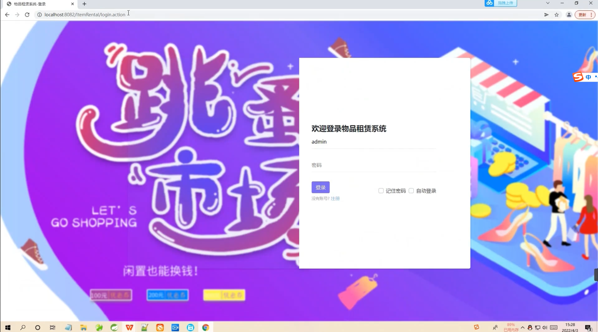
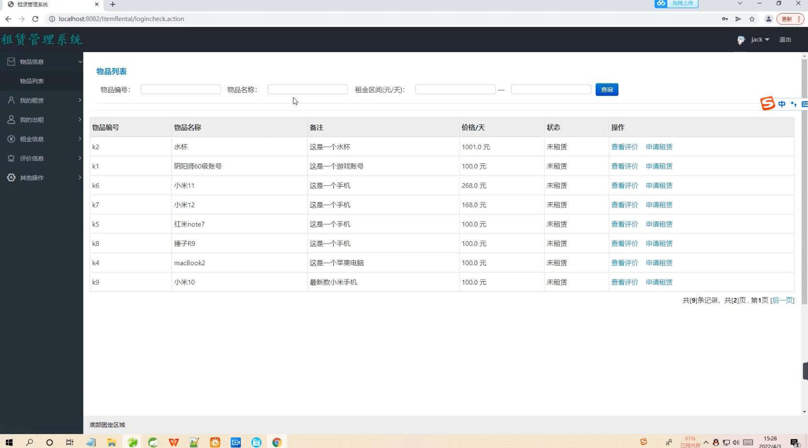
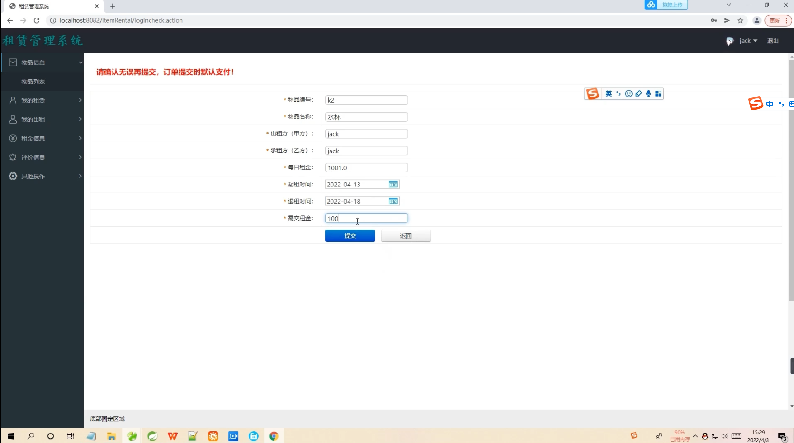
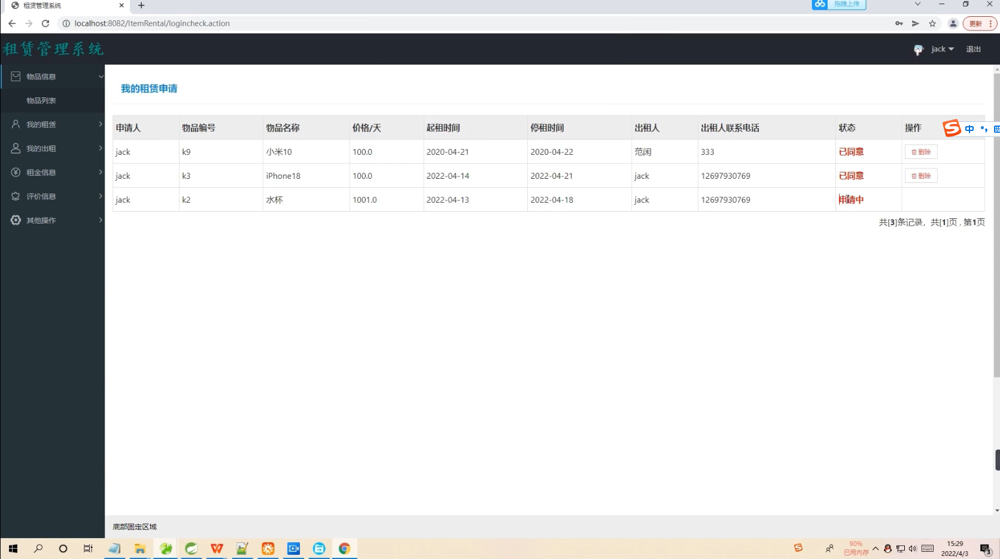
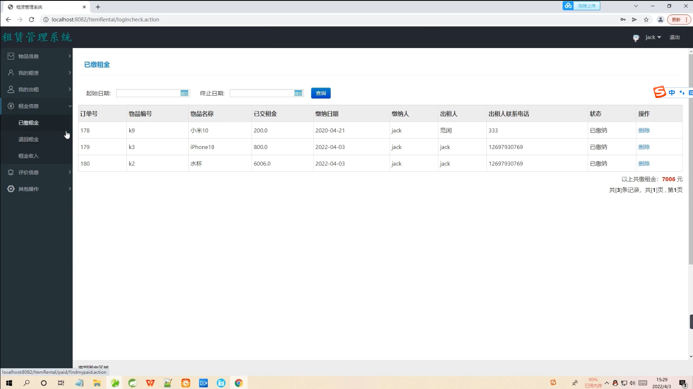
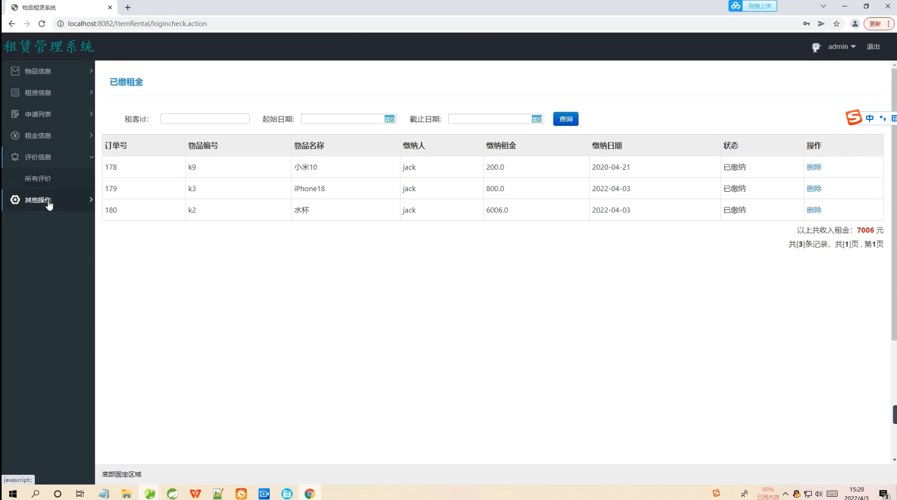
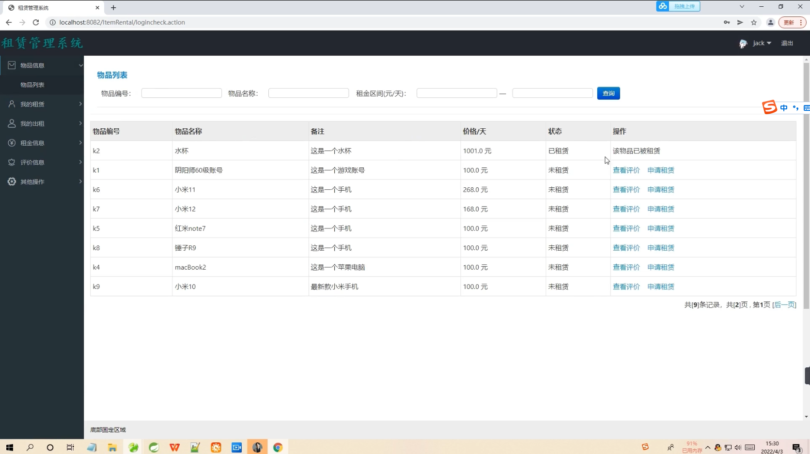
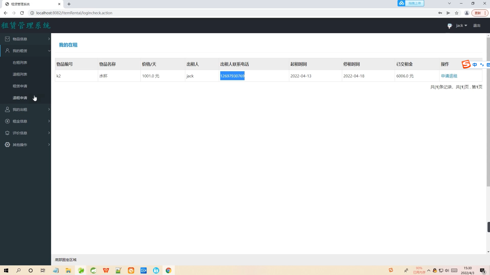

## 基于SSM框架实现的物品租赁系统

- <b>完整代码获取地址：从戎源码网 ([https://armycodes.com/](https://armycodes.com/))</b>
- <b>技术探讨、资料分享，请加QQ群：692619798</b> 
- <b>作者微信：19941326836  QQ：952045282</b> 
- <b>承接计算机毕业设计、Java毕业设计、Python毕业设计、深度学习、机器学习</b>
- <b>选题+开题报告+任务书+程序定制+安装调试+论文+答辩ppt 一条龙服务</b>
- <b>所有选题地址 ([https://github.com/YuLin-Coder/AllProjectCatalog](https://github.com/YuLin-Coder/AllProjectCatalog)) </b>

## 项目介绍
基于SSM框架实现的物品租赁系统，系统包含两种角色：,系统分为前台和后台两大模块，主要功能如下。

【管理员】：
1. 物品信息：管理员可以管理系统中的物品信息，包括添加、编辑和删除物品信息。
2. 租赁信息：管理员可以管理系统中的租赁信息，包括查看租赁记录、审核租赁申请等。
3. 申请列表：管理员可以查看用户提交的租赁申请列表，并进行审批操作。
4. 租金信息：管理员可以管理租金信息，包括设置租金标准、修改租金信息等。
5. 评价信息：管理员可以管理用户的评价信息，包括查看评价、回复评价等操作。
6. 其他操作：管理员可以进行其他管理操作，如查看系统日志、导出数据等。
7. 用户信息：管理员可以管理用户的个人信息，包括修改密码、修改个人资料等。

【用户】：
1. 物品信息：用户可以浏览系统中的物品信息，包括物品名称、价格、押金等。
2. 我的租赁：用户可以查看自己的租赁记录，包括已租赁的物品、租赁时间等。
3. 我的出租：用户可以查看自己的出租记录，包括已出租的物品、出租时间等。
4. 租金信息：用户可以查看物品的租金信息，包括租金标准、租金计算方式等。
5. 评价信息：用户可以进行物品的评价，包括评分、评论等。
6. 其他操作：用户可以进行其他操作，如申请租赁、取消租赁等。

## 项目技术
- 编程语言：Java
- 数据库：MySQL
- 前端技术：JSP、Jquery、Bootstrap、Layui
- 后端技术：Spring、SpringMVC、MyBatis

## 运行环境
- JDK版本：JDK1.8及以上
- 开发工具：IDEA、Ecplise、Myecplise都可以
- 数据库: MySQL5.7及以上

## 运行截图

